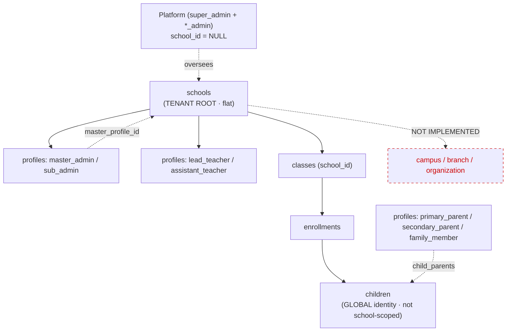
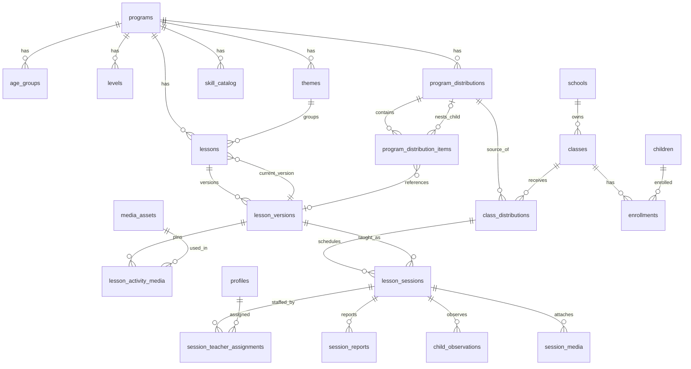
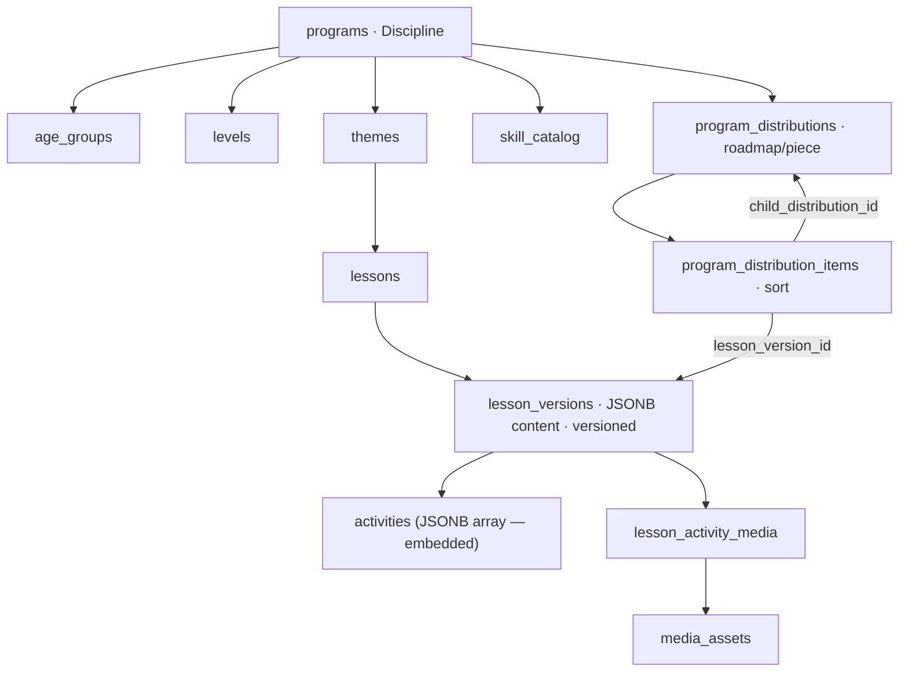
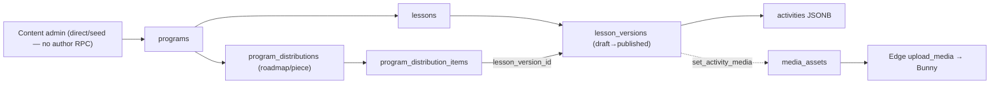
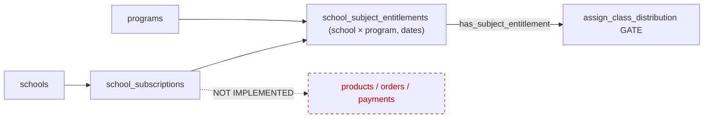
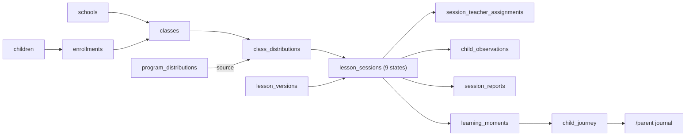
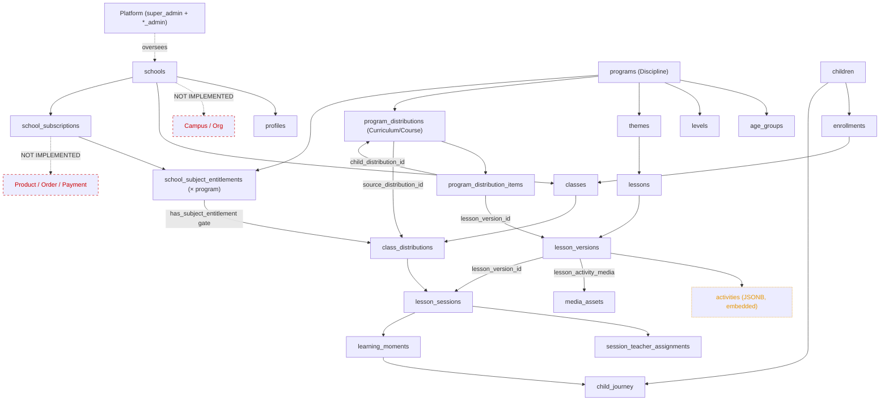

# DMA_SYSTEM_MODEL.md
### Bản mô tả trạng thái hiện tại của hệ thống — DMA (Dế Mèn Art / Art School Operating System)

> **Mục đích:** Để một AI / Technical Product Architect chưa từng xem source code có thể hiểu chính xác DMA hiện đang được xây như thế nào, đặc biệt phục vụ thiết kế tiếp **Content Architecture / Curriculum / Course / Lesson / Activity / Learning Asset** cho các bộ môn (Cảm Thụ Âm Nhạc, Ballet, Mỹ thuật, Piano…) bán cho các trường.
>
> **Phạm vi:** Chỉ **document hiện trạng**. Không redesign, không refactor, không đề xuất giải pháp.
>
> **Nguồn dữ liệu (live audit, 2026‑08‑26):**
> - Supabase project `xcvhacymrbhdhohyylyq` — schema thật (`pg_catalog` / `information_schema`), function bodies (`pg_get_functiondef`), enum values (`pg_enum`), FK graph (`pg_constraint`), RLS (`pg_policies`), `route_registry`, `admin_modules`, `edge_function_registry`.
> - Frontend repo Lovable `d9d56000‑3cf9‑4c46‑9890‑651edc53d73f` — `package.json` thật ở HEAD.
> - Governance: `DMA_SYSTEM_MAP.md` (canonical tip V128‑B14‑FE), memory handoff arc.
>
> **Quy ước trạng thái:** `IMPLEMENTED` · `PARTIAL` · `PLANNED` · `NOT IMPLEMENTED` · `UNKNOWN`.
>
> **Bảo mật:** Tài liệu này KHÔNG chứa password / API key / secret / access token / private credential / nội dung `.env`. Chỉ ghi *tên* environment variable ở nơi cần thiết.

---

## 0. LIVE INVENTORY SNAPSHOT (2026‑08‑26)

| Hạng mục | Giá trị (live-read) |
| --- | --- |
| Tables (`public`, relkind=r) | **92** |
| Functions (tổng) | **255** |
| Functions `SECURITY DEFINER` | **243** |
| RLS policies | **169** |
| Triggers (non-internal) | **34** |
| Edge Functions (registry) | **16** |
| Routes (`route_registry`) | **51** |
| Cron jobs | **1** (`purge_trash`, chạy đêm) |
| Programs | **3** (`ctan`, `ballet`, 1 QA-test draft) |
| Schools (tenants) | **5** |
| Children | **17** |

> Ghi chú: các con số này là **live-read của session hiện tại**; chúng cao hơn snapshot cũ trong `DMA_SYSTEM_MAP.md` (khối v1.46: 92·248·236·169) do system đã tăng trưởng qua các sprint B7→B14. Khi có mâu thuẫn, con số live-read ở đây là hiện hành cho ngày audit.

---

## 1. EXECUTIVE SUMMARY

**DMA là gì.** DMA (Dế Mèn Art) là một **B2B SaaS multi-tenant** — "Art School Operating System" — nền tảng vận hành giáo dục nghệ thuật mầm non, bán cho các **trường/chuỗi trường mầm non**. Sản phẩm nội dung đầu tiên là **CTAN (Cảm Thụ Âm Nhạc)**, sản phẩm thứ hai là **Ballet (Múa)**; kiến trúc được thiết kế để chứa nhiều bộ môn nghệ thuật (Mỹ thuật, Piano…).

**Đối tượng sử dụng (5 cổng/portal):**
- `/admin` — vận hành nền tảng (platform admin, content admin…).
- `/school` — hiệu trưởng / quản trị trường (`master_admin`, `sub_admin`).
- `/teacher` — giáo viên trên lớp (companion + màn chiếu lớp học).
- `/parent` — nhật ký & hành trình nghệ thuật của con (family journal).
- `/kid` — cổng trẻ em (PIN/device, đã có ở tầng backend + game/creation; xem §4, §27).

**Kiến trúc tổng thể.** Serverless-first: **Supabase (PostgreSQL + RLS + SECURITY DEFINER RPC + Deno Edge Functions)** làm backend/authority; **TanStack Start (React 19, SSR qua Nitro)** làm frontend; **Bunny CDN** (3 zone) làm media storage; **Cloudflare Pages** host production `demenart.com`. Backend là **nơi ra quyết định uỷ quyền duy nhất** (RLS + RPC); frontend chỉ trình bày.

**SaaS hay single/multi-tenant.** **Multi-tenant**. Tenant root = `schools`. Cách ly dữ liệu bằng RLS trên toàn bộ 92 bảng + tầng RPC `SECURITY DEFINER`. Có tầng **platform admin** (`super_admin` + họ content/ops/sales/support admin) đứng trên các tenant.

**Các module lớn đang có (IMPLEMENTED, trừ chỗ đánh dấu):**
1. **Multi-tenant & IAM** — schools, profiles (13 role), RLS, entitlement môn học.
2. **Curriculum / Content library** — programs → age_groups/levels/themes → lessons → lesson_versions (versioned, JSONB) → phân phối (`program_distributions`).
3. **Class & Teaching operations** — classes, class_distributions, lesson_sessions (9 trạng thái), session teacher assignment (versioned STA), attendance/observation, session report, prep, remote/TV projection.
4. **Media / Asset pipeline** — `media_assets` trên Bunny, signed URL edge, drive folders, trash lifecycle, consent-gated.
5. **Family Memory / Journey layer** — learning_moments, child_journey, parent_memories, memory_cards (family network), discovery_capsules, family_spaces. (Đây là phần được xây sâu nhất theo lịch sử sprint.)
6. **Kid portal** — kid_access/devices/pairing/sessions, kid_creations, kid_game_items.
7. **Commerce / Licensing (B2B)** — school_subscriptions + school_subject_entitlements (PARTIAL: xem §15–16).
8. **Mission Control OS (admin)** — object→action→decision→ledger governance layer (PARTIAL, đang mở rộng).
9. **Platform ops** — notifications, support, audit_logs (forensic), product_events (telemetry), admin reference/playbooks.

**Nghiệp vụ DMA đang giải quyết cho trường:** cấp quyền dùng bộ môn nghệ thuật cho trường; phân phối lộ trình/bài học xuống lớp; giáo viên dạy theo giáo án versioned + trình chiếu; ghi nhận quan sát/điểm danh/khoảnh khắc học tập của trẻ; và trả về **nhật ký nghệ thuật thuộc về trẻ & gia đình** (bất biến sản phẩm: *"art journal belongs to the child and family, not the school"*).

---

## 2. TECH STACK

Nguồn: `package.json` (repo HEAD) + governance.

### Frontend
- **Framework:** TanStack Start `@tanstack/react-start` **^1.167** (SSR, file-based routing) chạy trên **React 19.2**.
- **Routing:** `@tanstack/react-router` **^1.168** + `@tanstack/router-plugin` (flat-file dot-notation, ví dụ `admin.mission-control.index.tsx`). `Register` module để trong `src/router.tsx` (hand-authored) do `routeTree.gen.ts` bị regen — D344.5.
- **Data fetching:** `@tanstack/react-query` **^5.83**.
- **UI library:** **Radix UI primitives + shadcn/ui pattern** — `@radix-ui/react-*` (accordion, dialog, dropdown, popover, select, tabs, tooltip…), `class-variance-authority`, `clsx`, `tailwind-merge`, `tw-animate-css`. Icons `lucide-react`. Toast `sonner`. Drawer `vaul`. Command `cmdk`. Carousel `embla-carousel-react`. Charts `recharts`. Date `react-day-picker` + `date-fns`.
- **Styling:** **Tailwind CSS v4** (`tailwindcss` ^4.2 + `@tailwindcss/vite`).
- **Form system:** `react-hook-form` **^7.71** + `@hookform/resolvers` + **`zod` ^3.24** (schema validation).
- **Media playback:** `hls.js` (HLS streaming từ Bunny Stream). `input-otp` (PIN Kid). `qrcode.react`.
- **Build:** Vite **^8** + Nitro (SSR server) + `@lovable.dev/vite-tanstack-config` (tooling wrapper — pin governance, xem §29).
- **State management:** Không có Redux/Zustand trong dependencies → state cục bộ React + TanStack Query cache (server state). Không có global client store chuyên dụng (UNKNOWN nếu có context nội bộ, nhưng không có thư viện state ngoài).

### Backend
- **Platform:** **Supabase** (managed PostgreSQL) — không có backend framework tách rời (không Node/Express server riêng).
- **API architecture:** **RPC-centric** qua PostgREST — client gọi **SECURITY DEFINER RPC** (243 hàm) như API. Đọc/ghi trực tiếp bảng bị chặn/giới hạn bằng RLS; nghiệp vụ đi qua RPC.
- **Serverless / Edge:** **Deno Edge Functions** (16, xem §21) cho việc client-JWT không làm được (ký URL Bunny, upload, invitation, kid gate, cron purge).
- **Client SDK:** `@supabase/supabase-js` ^2.108.

### Database
- **DB:** PostgreSQL (Supabase). 92 bảng `public`.
- **Query layer:** SQL thuần trong RPC (`plpgsql`/`sql`). **Không có ORM.**
- **Migration:** Supabase migrations (registry ~119+; mẫu ba khối D92: DDL → REVOKE/GRANT hardening → VERIFY `RAISE EXCEPTION` rollback). Áp dụng qua `apply_migration`.

### Authentication
- **Provider:** Supabase Auth (`auth.users`). `profiles.user_id → auth.users.id`.
- **Session:** JWT của Supabase (`request.jwt.claims`). RLS đọc `auth.uid()`.
- **Login flow:** email + password (route `/auth`, `/reset-password`). Mời user qua Edge Function (`invite_master`, `invite_staff`, invitation cho parent/family). **Kid** dùng mô hình auth riêng: **device token hash + PIN** (KHÔNG `auth.uid()`) qua Edge `kid_gate`.
- **Role/permission:** `profiles.role` (enum `profile_role`) + `profiles.permissions text[]` (DB-driven).

### Storage
- **File storage:** **Bunny CDN** (`storage_provider='bunny'` mặc định trên `media_assets`). Ba zone:
  - `dma-public` — asset hệ thống/thương hiệu (âm thông báo…), token-auth OFF, URL vĩnh viễn.
  - `dma-learning` — media học liệu/curriculum, token-auth ON, phục vụ qua **signed URL ngắn hạn** (Edge).
  - `dma-private` — ảnh/báo cáo của trẻ, token-auth ON, **signed URL ngắn hạn** (Edge).
  - Video có thể qua **Bunny Stream** (`bunny_stream_video_id`, playback HLS).
- **Metadata:** trong bảng `media_assets` (Postgres). File nhị phân KHÔNG nằm trong Postgres.

### Infrastructure / Deployment
- **Hosting:** GitHub `main` → **Cloudflare Pages CI** → `demenart.com`. (Lovable hosting KHÔNG phải production source.)
- **CDN:** Bunny (media) + Cloudflare (app).
- **Background jobs / Cron:** **1 cron** gọi Edge `purge_trash` (dọn trash quá hạn) ban đêm.
- **Queue:** NOT IMPLEMENTED (không thấy hàng đợi).
- **Package manager (governance):** Bun là authority duy nhất; `bun.lock` là lockfile duy nhất; build `bun install --frozen-lockfile && bun run build`; guard `scripts/assert-tooling-governance.mjs` chặn pin non-canonical trước Vite.

---

## 3. MULTI-TENANCY MODEL

### Tenant root & cấu trúc
- **Tenant root = `schools`.** (5 hàng: `DEMO-001`, `KHM-DN`, `MNDM-DN`, `VNDM-DN`, +1.)
- **KHÔNG có bảng `campus` / `branch`** (đã kiểm tra: `campus_or_branch_table_exists = 0`). Cấu trúc trường **phẳng** — mỗi trường là một đơn vị, không phân cấp campus/chi nhánh. "Chuỗi/franchise" hiện được biểu diễn bằng **nhiều hàng `schools` độc lập**, không có object organization/brand đứng trên.
- **Organization / Brand:** NOT IMPLEMENTED (không có bảng tenant cha trên `schools`).

### User ↔ School
- `profiles.school_id → schools.id` (nullable). **Một profile thuộc tối đa một school.** Platform admin có `school_id = NULL`.
- **Một user thuộc nhiều school?** KHÔNG (theo hiện trạng): `users_with_multiple_profiles = 0`; mô hình là **1 `auth.users` → 1 `profiles` → 1 `school_id`**. (Hàm helper `user_school_ids()` trả về mảng, để mở khả năng tương lai, nhưng dữ liệu hiện tại là 1:1.)
- `schools.master_profile_id → profiles.id` (hiệu trưởng/master của trường).

### Child ↔ School (đặc biệt)
- **`children` KHÔNG bị school-scope trực tiếp.** Trẻ có **`global_child_id` (text) = danh tính di động**, `state (child_state)`, `merged_into` (dedupe). Trẻ gắn vào trường **gián tiếp** qua `enrollments → classes → schools`.
- Đây là hiện thân kỹ thuật của bất biến sản phẩm: **nhật ký/danh tính của trẻ thuộc về trẻ & gia đình, không thuộc trường** — trường có thể đổi nhưng danh tính trẻ vẫn liên tục.

### Data isolation
- **RLS:** BẬT trên toàn bộ 92 bảng; **169 policy**. Cách ly theo trường đi qua chuỗi helper `SECURITY DEFINER`:
  `current_school_id()`, `profile_school_id()`, `user_school_ids()`, `same_school()`, `child_in_my_school()`, `is_school_admin()`, `is_teacher_in_school()`, `session_school_id()`, `class_school_id()`, `moment_school_id()`, `cd_school_id()`…
- **Tenant ID (`school_id`) nằm ở các bảng:** `profiles`, `classes`, `child_transfers`, `ideas`, `media_assets.linked_school_id`, `school_settings`, `school_subscriptions`, `school_subject_entitlements`, `audit_logs`, `parent_invitations`, `privacy_requests`, `product_events`, `session_appreciations`, `drive_folders`, `schools` (self). Các bảng dưới trẻ/lớp suy ra `school_id` qua join (child→enrollment→class→school).
- **Super Admin / Platform Admin:** CÓ. `profile_role.super_admin` + họ `content_admin`, `senior_content_admin`, `operation_admin`, `sales_admin`, `support_admin`. Predicate `is_admin()` là **platform-only** (KHÔNG bao gồm `master_admin`) — platform admin không chạm PII trẻ (D48).

### Sơ đồ tenancy



---

## 4. USER / ROLE / PERMISSION MODEL

### Danh sách role (enum `profile_role`, 13 giá trị)

| Role | Nhóm | Scope | Ghi chú |
| --- | --- | --- | --- |
| `super_admin` | Platform | Toàn nền tảng | Quyền cao nhất; `school_id=NULL`. |
| `content_admin` | Platform | Curriculum | Quản trị học liệu (role tồn tại, chưa có profile dữ liệu). |
| `senior_content_admin` | Platform | Curriculum | (enum-only, chưa dùng.) |
| `operation_admin` | Platform | Vận hành | (enum-only, chưa dùng.) |
| `sales_admin` | Platform | Bán hàng/License | (enum-only, chưa dùng.) |
| `support_admin` | Platform | Hỗ trợ | (enum-only, chưa dùng.) |
| `master_admin` | School | 1 trường | Hiệu trưởng/quản trị trường. `is_admin()` KHÔNG gồm role này. |
| `sub_admin` | School | 1 trường | Nhân sự quản trị phụ. |
| `lead_teacher` | School | Lớp/buổi | GV chính; nguồn uỷ quyền theo **session responsibility** (D324/325). |
| `assistant_teacher` | School | Lớp/buổi | GV phụ. |
| `primary_parent` | Family | Trẻ của mình | Nhật ký/consent con. |
| `secondary_parent` | Family | Trẻ của mình | Phụ huynh thứ 2. |
| `family_member` | Family | Family space | Người thân (ông/bà…), membership ≠ guardianship (D269). |

### Role đang có dữ liệu thực (live count)
`super_admin` ×1 · `master_admin` ×5 · `lead_teacher` ×6 · `assistant_teacher` ×2 · `primary_parent` ×13 · `secondary_parent` ×1 · `family_member` ×1. (Các role platform khác: enum có, **chưa có profile**.)

### Cơ chế permission
- **Hybrid:** `role` (enum) là lớp thô + **`profiles.permissions text[]`** (mảng permission per-profile, **database-driven**, cộng thêm/tinh chỉnh).
- **Uỷ quyền hành động** không suy từ role đơn thuần mà qua **predicate RPC** (`is_school_admin`, `is_session_lead`, `is_session_responsible`, `is_distribution_lead`, `is_teacher_in_school`…). Đây là các "authority resolver" ở backend.
- **Bất biến uỷ quyền:** `Visibility ≠ Authority · Route ≠ Permission · Workspace ≠ Ownership · Signal ≠ Authorization`. Backend resolver là điểm quyết định duy nhất; frontend chỉ tiêu thụ cờ (vd `can_submit_journal`).
- **Session-scoped authority (D324/D325):** quyền hành động cấp buổi đi theo **`session_teacher_assignments`** (STA, versioned, append-only) — *session responsibility hiện hành*, KHÔNG theo class lead tĩnh.

### Bảng liên quan
`profiles`, `schools.master_profile_id`, `session_teachers`, `session_teacher_assignments`, `class_distributions.lead_teacher_id`, `child_parents`, `family_members` + `family_member_relationships`, `kid_access`, `policy_registry`, `admin_config_registry`.

---

## 5. DATABASE SCHEMA OVERVIEW

Dưới đây là **các bảng/entities chính theo domain** (bỏ qua timestamp/system field không trọng yếu). Toàn bộ 92 bảng đều có RLS bật.

### 5.1 Tenancy & IAM
| Table | Purpose | PK | FK chính | Tenant |
| --- | --- | --- | --- | --- |
| `schools` | Trường = tenant root | `id` | `master_profile_id→profiles` | self |
| `profiles` | User + role + permissions | `id` | `user_id→auth.users`, `school_id→schools` | school_id |
| `school_settings` | KV cấu hình trường (jsonb) | (`school_id`,`key`) | `school_id→schools` | school_id |

### 5.2 Curriculum / Content
| Table | Purpose | PK | FK chính | Field quan trọng |
| --- | --- | --- | --- | --- |
| `programs` | **Bộ môn / Discipline** (CTAN, Ballet) | `id` | — | `slug`, `state(content_state)`, `artistic_domain` |
| `age_groups` | Nhóm tuổi theo program | `id` | `program_id→programs` | `label`, `min_months`, `max_months` |
| `levels` | Cấp độ theo program | `id` | `program_id→programs` | `label`, `sort` |
| `themes` | Chủ đề (bucket) | `id` | `program_id`, `age_group_id`, `level_id` | `title`, `sort` |
| `lessons` | **Bài học (master)** | `id` | `program_id`, `theme_id`, `current_version_id→lesson_versions` | `title`, `slug` |
| `lesson_versions` | **Nội dung bài (versioned)** | `id` | `lesson_id→lessons`, `created_by` | `version_no`, `state(content_state)`, jsonb: `objectives/plan/activities/materials/checklist/adaptation/observation_criteria/guiding_questions/home_activities` |
| `lesson_activity_media` | Media ghim vào activity | `id` | `lesson_version_id`, `media_id→media_assets` | `activity_key(text)`, `material_role`, `parent_visible`, `kid_visible`, `sort_order` |
| `program_distributions` | **Lộ trình/Curriculum hoặc "piece"** | `id` | `program_id`, `age_group_id` | `type(distribution_type: roadmap\|piece)`, `state`, `default_session_count` |
| `program_distribution_items` | Item có thứ tự trong distribution | `id` | `parent_distribution_id`, `child_distribution_id` (nesting), `lesson_version_id` | `sort`, `default_title`, `default_duration_min` |
| `themes`/`skill_catalog`/`home_activities` | Chủ đề · kỹ năng theo program · hoạt động về nhà | `id` | `program_id` | — |
| `ideas` | Pipeline đề xuất nội dung | `id` | `program_id/age_group_id/level_id/theme_id/linked_lesson_id/proposer/school` | `status(idea_state)`, `tags(jsonb)` |

### 5.3 Class & Teaching
| Table | Purpose | PK | FK chính | Field |
| --- | --- | --- | --- | --- |
| `classes` | Lớp học của trường | `id` | `school_id`, `age_group_id`, `level_id` | `name`, `state` |
| `class_distributions` | **Curriculum gán cho lớp** | `id` | `class_id`, `program_id`, `source_distribution_id→program_distributions`, `lead_teacher_id` | `state`, `applied_by/at` |
| `enrollments` | Trẻ ↔ Lớp | `id` | `child_id`, `class_id` | `state(enrollment_state)`, `school_student_code`, start/end |
| `lesson_sessions` | **Buổi học thực tế** | `id` | `class_distribution_id`, `lesson_version_id`, `distribution_item_id`, `taught_by` | `scheduled_at`, `duration_min`, `content_override(jsonb)`, `state(session_state)`, `remote_channel_key/code` |
| `session_teachers` | GV của buổi (đơn giản) | `id` | `session_id`, `profile_id` | — |
| `session_teacher_assignments` | **STA — phân công cấp buổi, versioned/append-only** | `id` | `session_id`, `teacher_id`, `superseded_by(self)` | `assignment_type`, `responsible` dimension |
| `prep_items` | Checklist chuẩn bị buổi | `id` | `session_id`, `created_by` | `label`, `is_ready` |
| `session_marks` | Điểm danh/đánh dấu buổi | `id` | `session_id`, `created_by` | — |
| `session_reports` | Báo cáo buổi | `id` | `session_id` | — |
| `child_observations` | Quan sát trẻ theo buổi | `id` | `child_id`, `session_id`, `recorded_by` | — |
| `session_appreciations` | PH cảm ơn GV (per buổi) | `id` | `session_id`, `child_id`, `recipient_teacher_profile_id`, `recipient_assignment_id`, `sender_parent_profile_id`, `school_id` | `acknowledged_at` |

### 5.4 Media / Asset
| Table | Purpose | PK | FK chính | Field |
| --- | --- | --- | --- | --- |
| `media_assets` | **Asset trên Bunny** | `id` | polymorphic `linked_*` (school/class/child/lesson_version/session/moment/space), `folder_id→drive_folders`, `created_by/uploaded_by` | `storage_provider/zone`, `bunny_path`, `cdn_pull_zone`, `bunny_stream_video_id`, `access_level`, `protection_mode`, `watermark_required`, `download_allowed`, `stream_only`, `expires_policy_minutes`, `file_type`, `size_bytes`, `source`, `state`, `version_no`, `approval_status`, `metadata(jsonb)`, trash: `trashed_at/by`, `restore_*` |
| `media_variants` | Biến thể responsive | `id` | `media_id` | `variant`, `bunny_path` — **0 hàng (chưa dùng)** |
| `session_media` | Media gắn buổi | `id` | `session_id`, `media_id` | `kind`, `source`, `sort_order` |
| `drive_folders` | Cây thư mục (Drive) | `id` | `parent_id(self)`, `school_id`, `owner_profile_id` | — |
| `albums` | Album theo trẻ/lớp | `id` | `child_id`, `class_id` | `type`, `title` |

### 5.5 Family Memory / Journey (subsystem đã build sâu)
`learning_moments`, `moment_children`, `child_journey`, `child_skills`, `badges`/`child_badges`, `parent_memories`/`parent_memory_media`, `memory_threads`/`memory_messages`, `discovery_capsules`/`discovery_capsule_items`, `family_spaces`/`family_space_children`/`family_members`/`family_member_relationships`/`family_invitations`, `memory_cards`/`card_person_links`/`card_media`/`card_acknowledgements`/`card_contributions`/`contribution_media`, `preserve_records`, `share_links`, `consents`, `privacy_requests`.

### 5.6 Kid portal
`kid_access`, `kid_devices`, `kid_pairing_codes`, `kid_sessions`, `kid_reactions`, `kid_creations`, `kid_game_items`.

### 5.7 Commerce / Licensing
`school_subscriptions`, `school_subject_entitlements`, `pricing_config`.

### 5.8 Platform / Ops / Mission Control
`notifications`/`notification_types`/`notification_sounds`, `support_requests`, `audit_logs`, `product_events`, `app_settings`, `admin_module_groups`/`admin_modules`/`admin_module_links`, `admin_playbooks`/`admin_playbook_steps`, `admin_config_registry`, `policy_registry`, `edge_function_registry`, `route_registry`, `skill_catalog`, `mission_control_object_registry`/`mission_control_action_registry`/`mission_control_action_requests`/`mission_control_decisions`/`mission_control_decision_transitions`, `child_transfers`, `child_duplicates`, `child_parents`, `parent_invitations`, `family_invitations`.

### 5.9 ER Diagram — lõi Content + Teaching



---

## 6. CURRENT DOMAIN MODEL

| Concept | Tồn tại? | Object/bảng thực tế | Đại diện cho | Relationship chính | Dùng ở UI |
| --- | --- | --- | --- | --- | --- |
| School | ✅ | `schools` | Trường (tenant root, phẳng) | ←profiles, classes, subscriptions | `/school/*`, `/admin/school-onboarding` |
| Campus | ❌ | — | — | — | — |
| User | ✅ | `profiles`(+`auth.users`) | Tài khoản + role | school_id | tất cả portal |
| Teacher | ✅ | `profiles` role `lead/assistant_teacher` | GV | session assignment | `/teacher/*` |
| Student | ✅ | `children` (+`enrollments`) | Trẻ (danh tính global) | enrollment→class | `/school`, `/teacher`, `/parent` |
| Parent | ✅ | `profiles` role `*_parent` + `child_parents` | Phụ huynh | child_parents | `/parent/*` |
| Class | ✅ | `classes` | Lớp học | school, age_group, level | `/teacher/classes`, `/school` |
| Subject/Discipline | ✅ | `programs` (`artistic_domain`) | Bộ môn nghệ thuật | ←lessons, distributions, entitlements | `/admin/curriculum-*` |
| Program | ✅ (=Subject) | `programs` | (DMA gộp Subject≡Program) | — | — |
| Curriculum | ✅ (dạng distribution) | `program_distributions`(+items) | Lộ trình/giáo trình | program, items→lesson_versions | `/admin` (program-distribution) |
| Course | ⚠️ PARTIAL | ≈ `program_distributions` type `roadmap` | Không có bảng `courses` riêng | — | — |
| Module/Unit | ⚠️ PARTIAL | `themes` (bucket) + `program_distribution_items` (nesting) | Đơn vị nhóm | — | — |
| Lesson | ✅ | `lessons` + `lesson_versions` | Bài học + nội dung versioned | theme, program | `/admin/curriculum-admin`, `/teacher/curriculum` |
| Activity | ⚠️ EMBEDDED | `lesson_versions.activities` (JSONB) | Hoạt động trong bài | KHÔNG có bảng riêng | render trong lesson guide |
| Learning Asset / Media | ✅ | `media_assets` | Học liệu/ảnh/video | linked_* polymorphic | `/admin/curriculum-library`, `/teacher/media`, `/school/drive` |
| File | ✅ | `media_assets` (+ Bunny) | File nhị phân | — | — |
| Assignment (curriculum→class) | ✅ | `class_distributions` | Gán lộ trình cho lớp | class, source_distribution | Mission Control `class.assign` |
| Attendance | ⚠️ PARTIAL | `session_marks` + rollup RPC | Điểm danh | session | `get_school_attendance_rollup` |
| Schedule | ✅ | `lesson_sessions.scheduled_at` (+week RPC) | Lịch buổi | class_distribution | `/school` week schedule |
| Enrollment | ✅ | `enrollments` | Ghi danh trẻ vào lớp | child, class | `/school` |
| Subscription | ✅ | `school_subscriptions` | Gói thuê bao trường | school | admin (module) |
| Product | ❌ | — | Không có "product" bán riêng | — | — |
| Package | ❌ | — | — | — | — |
| License / Entitlement | ✅ (cấp môn) | `school_subject_entitlements` | Trường được dùng bộ môn | school×program, time-bounded | `school-entitlements` (Đăng ký môn) |
| Order | ❌ | — | Không có bảng order | — | — |
| Payment | ⚠️ FIELD-ONLY | `school_subscriptions.payment_status/total_amount` | Chỉ field, không có payment ledger | — | — |
| Skill | ✅ | `skill_catalog` + `child_skills` | Kỹ năng theo program | program, child | teacher/parent |

**Subsystem lớn ngoài bảng trên (IMPLEMENTED, đặc thù DMA):** Family Memory / Journey (learning_moments → child_journey → parent_memories → memory_cards → discovery_capsules → family_spaces) và Kid portal — đây là "linh hồn sản phẩm" (nhật ký thuộc về trẻ/gia đình), không phải phần curriculum-authoring.

---

## 7. COURSE / CURRICULUM MODEL HIỆN TẠI

### Cấu trúc thực tế

```
programs  (Discipline/Subject: CTAN, Ballet)
  ├─ age_groups   (min_months–max_months, per program)
  ├─ levels       (per program)
  ├─ skill_catalog(per program)
  ├─ themes       (program [+age_group +level])           ← "bucket" chủ đề
  │    └─ lessons (program [+theme])                        ← Bài học (MASTER)
  │         └─ lesson_versions (versioned content, JSONB)   ← nội dung thật, có version_no + content_state
  │              └─ lesson_activity_media (media theo activity_key)
  └─ program_distributions (type = roadmap | piece)         ← CURRICULUM / GIÁO TRÌNH
       └─ program_distribution_items (sort)
            ├─ lesson_version_id   (item = 1 bài cụ thể)
            └─ child_distribution_id (item = 1 distribution con → NESTING)
```

### Trả lời từng câu hỏi
- **Course là gì?** DMA **không có object `courses` riêng**. Vai trò "course/giáo trình" do **`program_distributions` type `roadmap`** đảm nhiệm (vd *"Lộ trình CTAN học kỳ 1"*, `default_session_count=12`).
- **Curriculum là gì?** `program_distributions` + `program_distribution_items` = danh sách có thứ tự các bài (lesson_version) hoặc distribution con.
- **Lesson là gì?** `lessons` (master, ổn định) + `lesson_versions` (nội dung versioned).
- **Có Module/Unit không?** ⚠️ PARTIAL. Có hai cơ chế gộp: (a) `themes` (chủ đề, cắt theo age_group/level), (b) **nesting distribution** qua `program_distribution_items.child_distribution_id`. Không có bảng `modules`/`units` tường minh.
- **Có Activity bên trong Lesson không?** ✅ nhưng **embedded** — `lesson_versions.activities` là **JSONB array** (không phải bảng). Mỗi activity: `{key, title, script, objective, questions[]}`.
- **Lesson dùng lại giữa nhiều Course?** ✅ YES về kiến trúc — `program_distribution_items.lesson_version_id` cho phép cùng một `lesson_version` xuất hiện trong nhiều distribution.
- **Age group?** ✅ `age_groups` (theo tháng, xem §11).
- **Subject/Discipline?** ✅ `programs.artistic_domain`.
- **Learning objectives?** ✅ `lesson_versions.objectives` + `development_objectives` (jsonb).
- **Prerequisite?** ❌ NOT IMPLEMENTED (không có field/quan hệ prerequisite).
- **Duration?** ✅ `program_distributions.default_session_count`, `program_distribution_items.default_duration_min`, `lesson_sessions.duration_min`.
- **Sequence/order?** ✅ `program_distribution_items.sort`, `themes.sort`, `lesson_activity_media.sort_order`.

### Hierarchy diagram (thực tế)



---

## 8. LESSON MODEL

### `lessons` (master)
`id`, `program_id`, `theme_id`, `title`, `slug`, `current_version_id → lesson_versions`. → Bản thân "bài" ổn định; con trỏ tới version hiện hành.

### `lesson_versions` (nội dung)
`id`, `lesson_id`, `version_no (int, default 0, auto-increment qua trigger `lesson_version_autoincrement`)`, `state (content_state: draft/review/needs_revision/approved/published/archived)`, `published_at`, `created_by`, `change_notes`, và các cột **JSONB**:

| Field (jsonb) | Ý nghĩa |
| --- | --- |
| `objectives` | Mục tiêu bài |
| `development_objectives` | Mục tiêu phát triển |
| `plan` | Kế hoạch buổi — object `{ steps: [...] }` |
| `activities` | **Mảng hoạt động** (xem §9) |
| `materials` | Học liệu cần |
| `checklist` | Checklist chuẩn bị |
| `adaptation` | Điều chỉnh/phân hoá |
| `observation_criteria` | Tiêu chí quan sát trẻ |
| `guiding_questions` | Câu hỏi gợi mở |
| `home_activities` | Hoạt động về nhà |

### Trả lời checklist
- **Content lưu như thế nào?** JSONB structured fields (không rich-text HTML/block-editor). `script` trong activity là text hội thoại GV.
- **Block/component structure?** ⚠️ Có ở dạng **mảng `activities` JSONB**, không phải block-editor tổng quát.
- **Rich text?** ❌ Không có rich-text/HTML lưu trữ; toàn text/JSON.
- **Media embedding?** ✅ qua `lesson_activity_media` (ghim `media_assets` theo `activity_key`), có cờ `parent_visible`/`kid_visible`/`material_role`.
- **Teacher instruction?** ✅ `activities[].script`, `plan.steps`, `checklist`, `guiding_questions`.
- **Student-facing content?** ⚠️ gián tiếp qua `kid_visible`/`parent_visible` trên media + `home_activities`; không có "student view" tách riêng của bài.
- **Sequencing?** ✅ thứ tự trong mảng `activities` + `plan.steps` + `lesson_activity_media.sort_order`.
- **Lesson status?** ✅ `state (content_state)`.
- **Version?** ✅ `version_no` + chuỗi version + `lessons.current_version_id`.

### Ví dụ schema `activities` (làm sạch, từ dữ liệu thật CTAN)
```json
[
  {
    "key": "warmup",
    "title": "Khởi động",
    "objective": "Bé ổn định tâm thế, làm quen không khí buổi học bằng vận động nhẹ.",
    "script": "Chào các con! Trước khi bắt đầu, mình cùng vươn vai, hít thở sâu và lắc lư nhẹ theo cô nào.",
    "questions": [
      "Hôm nay con cảm thấy thế nào?",
      "Con đã sẵn sàng cùng cô khám phá âm thanh chưa?"
    ]
  }
]
```
Top-level keys quan sát được trên toàn bảng: `key`, `title`, `objective`, `script`, `questions`. `plan` có key `steps`.

---

## 9. ACTIVITY / CONTENT BLOCK MODEL

**Kết luận:** `CURRENTLY NO REUSABLE ACTIVITY ENTITY.`

- Không có bảng `activities` / `blocks` / `sections` / `steps` / `lesson_items` / `content_items` **độc lập, tái sử dụng bằng tham chiếu**.
- Activity tồn tại **nhúng** trong `lesson_versions.activities` (JSONB array).
- Cấu trúc mỗi activity: `key`, `title`, `objective`, `script`, `questions[]` (không có `duration`, `type`, `student_note` riêng biệt).
- **Ordering:** theo thứ tự phần tử trong mảng.
- **Media theo activity:** `lesson_activity_media` liên kết `media_assets` với `(lesson_version_id, activity_key)` — `activity_key` là **text tự do khớp `activities[].key`**, KHÔNG phải FK. Có `material_role`, `parent_visible`, `kid_visible`, `sort_order`.
- **Teacher note / instruction:** trong `script`/`plan.steps`.
- **Reusability:** một activity muốn dùng lại ở bài khác phải **copy JSON** (không tham chiếu). → tái dùng cấp activity = **NO** (chỉ copy).

RPC liên quan: `set_activity_media`, `unset_activity_media` (gắn/gỡ media cho activity).

---

## 10. LEARNING ASSET / MEDIA MODEL

### Bảng `media_assets` (112 hàng) — asset library trung tâm
- **Lưu ở đâu:** file nhị phân trên **Bunny** (zone `dma-public`/`dma-learning`/`dma-private`); metadata trong Postgres.
- **ID riêng:** ✅ `media_assets.id (uuid)`.
- **Metadata DB:** `storage_provider`, `storage_zone`/`bunny_storage_zone`, `bunny_path`, `cdn_pull_zone`, `bunny_stream_video_id`, `file_type`, `size_bytes`, `access_level (enum)`, `protection_mode (enum)`, `watermark_required`, `download_allowed`, `stream_only`, `expires_policy_minutes`, `source`, `state`, `version_no`, `approval_status`, `metadata (jsonb)`, `media_group`, trash lifecycle (`trashed_at/by`, `restore_*`), `folder_id`.
- **Một asset dùng nhiều nơi?** ✅ YES — liên kết **polymorphic qua nhiều cột `linked_*`**: `linked_school_id`, `linked_class_id`, `linked_child_id`, `linked_lesson_version_id`, `linked_session_id`, `linked_moment_id`, `linked_space_id`; và qua bảng cầu nối (`lesson_activity_media`, `session_media`, `card_media`, `contribution_media`, `parent_memory_media`). Một asset có thể xuất hiện ở curriculum + session + moment.
- **Category:** ⚠️ qua `access_level`, `media_group`, `file_type`, `source`, `folder_id` — không có bảng `categories` riêng.
- **Tags:** ❌ không có tag chuẩn hoá cho asset (chỉ `metadata` jsonb tự do).
- **Copyright/license metadata:** ❌ NOT IMPLEMENTED (không có field license/copyright trên asset).
- **Version:** ⚠️ `version_no` (int) + `media_variants` (bảng biến thể, **0 hàng — chưa dùng**).
- **Upload workflow:** ✅ Edge `upload_media` (PUT Bunny; route zone theo loại: ảnh trẻ→`dma-private`, học liệu→`dma-learning`) với gate `check_media_upload_access`/`check_curriculum_upload_access`/`check_session_media_upload_access`. Ký đọc qua Edge `get_signed_media_url` (route theo cột link; kid qua kid session token).

### Loại file (theo `file_type`/`access_level`) hỗ trợ
Image, Audio (âm nhạc CTAN, notification sounds), Video (Bunny Stream + HLS), PDF/Document (`contract_file`, `report_file`, `support_file` access levels), thumbnail. **Slide/Worksheet/Flashcard**: không có type chuyên biệt (dùng chung image/pdf) → PARTIAL.

### `access_level` enum (8)
`public`, `private_child_media`, `private_curriculum`, `private_school_resource`, `contract_file`, `report_file`, `support_file`, `private_family_media`.
### `protection_mode` enum (4)
`public`, `signed_url`, `signed_stream`, `drm_future`.

---

## 11. AGE GROUP MODEL

- **Có bảng riêng:** ✅ `age_groups`.
- **Biểu diễn:** **number range theo tháng** — `min_months`, `max_months` (integer), + `label` (text hiển thị), + `sort`, gắn `program_id`.
- **Dữ liệu thật:** `"3–4 tuổi"` (36–48 tháng), `"4–5 tuổi"` (48–60 tháng).
- **Biểu diễn 1–3 / 3–4 / 4–5 / 5–6?** ✅ được — bằng cách thêm hàng `age_groups` với min/max tháng tương ứng (per program).
- **Không phải** string thô / enum / grade cứng — mà là **bảng range (tháng) per-program**.
- Tham chiếu từ: `classes.age_group_id`, `themes.age_group_id`, `program_distributions.age_group_id`, `ideas.age_group_id`.

---

## 12. DISCIPLINE / SUBJECT MODEL

- **Object tương đương `Discipline`:** **`programs`** — với cột **`artistic_domain`** (vd `music` cho CTAN, `dance_movement` cho Ballet). RPC `set_program_artistic_domain` để đặt.
- **Dữ liệu thật:** `ctan` (Cảm Thụ Âm Nhạc Dế Mèn · `music` · published), `ballet` (Múa Ballet Dế Mèn · `dance_movement` · published), + 1 program QA-test (draft). → **Mỹ thuật / Piano chưa tồn tại như program**, nhưng kiến trúc sẵn sàng (thêm hàng `programs` + `artistic_domain`).
- **Relationship của `programs`:**
  - → Curriculum: `program_distributions.program_id`, `lessons.program_id`, `themes.program_id`, `age_groups`/`levels`/`skill_catalog.program_id`.
  - → Teacher/Class: qua `class_distributions.program_id` (lớp nhận distribution của program).
  - → Student: gián tiếp (child → enrollment → class → class_distribution → program); `child_journey.program_id` ghi hành trình theo program.
  - → Product/Commerce: **`school_subject_entitlements.program_id`** = đơn vị cấp quyền B2B (xem §16). *"Subject" ≡ "Program" trong DMA.*

---

## 13. CLASS & TEACHING MODEL

### Chuỗi thực tế
```
programs → program_distributions (roadmap)
                    │ source_distribution_id
                    ▼
schools → classes → class_distributions ──► lesson_sessions ──► (report / observation / marks / media / moments)
             │            │ lead_teacher_id        │
             │            │                         ├─ session_teacher_assignments (STA · versioned responsibility)
             └─ enrollments ─ children              └─ prep_items
```

- **Class:** `classes` (school, age_group, level, state).
- **Teacher assignment:**
  - Cấp lớp/lộ trình: `class_distributions.lead_teacher_id` + RPC `set_distribution_lead`/`is_distribution_lead`.
  - Cấp **buổi**: `session_teachers` (đơn giản) + **`session_teacher_assignments` (STA)** — nguồn uỷ quyền thật cho hành động cấp buổi (D324/325, versioned, append-only, `responsible` dimension). RPC `set_session_teachers`, predicate `is_session_lead`/`is_session_responsible`/`is_session_teacher`.
- **Students trong lớp:** `enrollments` (state `active/paused/transferred_*/ended/graduated`).
- **Course/Curriculum → Class:** `program_distributions --source_distribution_id--> class_distributions`; gán qua RPC **`assign_class_distribution`** (Mission Control `class.assign`), **có gate entitlement** `has_subject_entitlement`.
- **Session → Lesson:** `lesson_sessions.lesson_version_id` (+ `distribution_item_id`, + `content_override` jsonb cho tuỳ biến buổi).
- **Attendance:** `session_marks` + `get_school_attendance_rollup` (rollup) — PARTIAL (xem §14/§24).

**Quan hệ `Course/Curriculum → Class → Session → Lesson`:** ✅ tồn tại đầy đủ (qua `program_distributions → class_distributions → lesson_sessions → lesson_versions`).

---

## 14. TEACHING SESSION / CLASS SESSION MODEL

**Object cho từng buổi thực tế:** ✅ **`lesson_sessions`**.

| Lưu gì | Có? | Cột/nguồn |
| --- | --- | --- |
| Ngày/giờ | ✅ | `scheduled_at`, `duration_min` |
| Teacher | ✅ | `taught_by` + `session_teachers` + `session_teacher_assignments` (STA) |
| Lesson | ✅ | `lesson_version_id`, `distribution_item_id`, `content_override(jsonb)` |
| Attendance | ⚠️ PARTIAL | `session_marks`; rollup `get_school_attendance_rollup` |
| Notes | ✅ | `prep_items`, `child_observations`, `content_override` |
| Completion | ✅ | `state (session_state)` — 9 trạng thái |
| Teacher feedback | ✅ | `session_reports`, `child_observations` |
| Student progress | ✅ | `child_observations`, `child_journey`, `child_skills`, `learning_moments` |

**`session_state` (9):** `scheduled → prep_ready → in_progress → taught_report_pending → report_pending_approval → completed`; ngoài ra `cancelled`, `rescheduled`, `makeup`.

**Vòng đời buổi (RPC):** `create_lesson_session` → `update_lesson_session` / `cancel_lesson_session` → `start_session` → (dạy, capture media/moment qua Edge) → `submit_session_journal`. Trình chiếu TV/điều khiển từ xa: `remote_channel_key/code` + Edge `mint_session_remote_code`/`redeem_session_remote_code`, route `/remote`. Đọc buổi: `get_session_detail`, `get_session_readiness`, `get_session_roster`, `get_session_curriculum`, `get_session_moments`, `get_teacher_session_workspace`.

---

## 15. PRODUCT / COMMERCE MODEL

- **Có object `product` bán riêng?** ❌ **KHÔNG.** Không có bảng `products`/`packages`/`orders`.
- **Đơn vị thương mại hiện tại:**
  - `school_subscriptions` — gói thuê bao **cấp trường**: `state (subscription_state: trial/active/past_due/expired/cancelled)`, `billing_period`, `start/end_date`, **`seat_count`**, `storage_base_mb` + `storage_addon_mb`, `contract_file_media_id` (link hợp đồng PDF), `payment_status`, `total_amount`.
  - `school_subject_entitlements` — quyền dùng **từng bộ môn** (xem §16).
  - `pricing_config` — cấu hình giá nền tảng (key/value/note; 4 hàng).
- **Course content có bị gắn trực tiếp vào Product bán hàng không?**
  → **ĐÃ TÁCH RỜI.** Nội dung (`programs`/`lessons`/`distributions`) **không** tham chiếu tới subscription/product. Ranh giới thương mại nằm ở **`school_subject_entitlements.program_id`** (mua = mở quyền ở cấp *program/bộ môn*), tách khỏi cây nội dung. Không có FK từ curriculum → commerce.
- **Payment ledger:** ❌ chỉ có field `payment_status`/`total_amount` trên subscription; không có bảng giao dịch/hoá đơn.

Dữ liệu subscription thật (đã ẩn PII): `DEMO-001` (annual, active, seat 4) · `KHM-DN` (trial, seat 4) · `MNDM-DN` (trial, seat 3). Chưa gắn file hợp đồng.

---

## 16. SCHOOL LICENSING / ENTITLEMENT

**Cơ chế "Trường A được dùng Bộ môn X từ ngày A đến ngày B":** ✅ **IMPLEMENTED** ở cấp **program (bộ môn)**.

### `school_subject_entitlements`
| Cột | Ý nghĩa |
| --- | --- |
| `school_id → schools` | Trường nào |
| `program_id → programs` | **Bộ môn nào** (đơn vị cấp quyền) |
| `subscription_id → school_subscriptions` | Thuộc gói nào (nullable) |
| `status (subscription_state)` | trial/active/past_due/expired/cancelled |
| `start_date`, `end_date` | **Thời hạn** (null end = vô hạn) |

### Hàm enforce
```sql
has_subject_entitlement(p_school_id, p_program_id) -- STABLE SECURITY DEFINER
  → EXISTS trong school_subject_entitlements
    WHERE status IN ('trial','active')
      AND (end_date IS NULL OR end_date >= current_date)
```
**Điểm enforce (live):** hàm này được gọi tại **`assign_class_distribution`** và **`get_mission_control_actions`**. → Entitlement chặn **hành động gán lộ trình bộ môn vào lớp**. ⚠️ **Không** thấy nó gác pervasive ở các RPC đọc curriculum (`get_curriculum_library_tree`, `list_curriculum_media`, `get_teacher_session_workspace`…) → việc chặn *đọc nội dung* theo entitlement là **PARTIAL** (chủ yếu chặn ở cửa gán, không phải mọi đường đọc).

### Trả lời checklist
- School nào truy cập program nào? ✅ (bảng entitlement). Dữ liệu thật: `DEMO-001`→ctan+ballet (active); `KHM-DN`→ctan+ballet (trial); `MNDM-DN`→ctan (trial); `VNDM-DN`→ballet (active).
- Thời hạn? ✅ `start_date`/`end_date`.
- Campus scope? ❌ (không có campus).
- Teacher/Student/Seat limit? ⚠️ **`seat_count`** ở cấp `school_subscriptions` (không phân biệt teacher/student seat; không enforce hard limit trong entitlement).
- Subscription status? ✅ `subscription_state`.
- **Granularity:** quyền ở cấp **program/bộ môn** — KHÔNG ở cấp course/distribution/lesson. → "Trường mua CTAN" mở toàn bộ CTAN, không mua lẻ lộ trình.

Module UI: `school-entitlements` ("Đăng ký môn (License)") = **live**; `school-license` ("License Trường (B2B)") = **planned**; `parent-license` = **planned**.

---

## 17. VERSIONING / PUBLISHING MODEL

**Enum `content_state`:** `draft → review → needs_revision → approved → published → archived`.

| Entity | Draft/Review/Published? | Version? | Cột |
| --- | --- | --- | --- |
| `programs` | ✅ (`content_state`) | ❌ | `state` |
| `program_distributions` | ✅ (`content_state`) | ❌ (không version_no) | `state` |
| `lesson_versions` | ✅ (`content_state`) | ✅ **có version chain** | `state`, `version_no`, `published_at`, `lessons.current_version_id` |
| `lessons` | (state ở version) | ✅ qua versions | `current_version_id` |
| `media_assets` | ⚠️ `approval_status` + `state` (active…) | ⚠️ `version_no` (không chain rõ) | — |

- **Version thực sự:** chỉ `lesson_versions` có mô hình version đầy đủ (master `lessons` + nhiều version + con trỏ current + trigger auto-increment `lesson_version_autoincrement`).
- **Publish workflow:** biểu diễn bằng **chuyển `state`** (enum). **Không có RPC `publish_*` chuyên cho curriculum** trong danh sách hàm → chuyển state hiện qua ghi bảng cấp admin (RLS) / seed, **không** qua RPC publish tường minh. (RPC `publish_*` chỉ tồn tại cho memory cards: `publish_memory_card`/`publish_family_card`/`unpublish_memory_card`.)
- **Archived:** có trong enum, dùng được.

---

## 18. CONTENT AUTHORING WORKFLOW

**Trạng thái tổng: ⚠️ PARTIAL** — có UI đọc/quản trị + vài mutation nhỏ, **thiếu tầng RPC authoring CRUD đầy đủ** cho curriculum.

Bằng chứng: trong 255 hàm, các RPC `create_*`/`update_*`/`upsert_*` **không** bao gồm `create_program` / `create_lesson` / `create_lesson_version` / `create_distribution` / `create_theme`. Các create RPC tồn tại là: `create_lesson_session`, `update_lesson_session`, `create_child_and_enroll`, và họ create của memory/family (card/memory/space/share_link). → Việc **tạo program/lesson/version/distribution** hiện **không đi qua RPC** (suy ra: ghi trực tiếp bảng ở quyền admin qua RLS, hoặc seed migration).

Mutation curriculum có RPC: `set_activity_media`, `unset_activity_media`, `set_program_artistic_domain`, `assign_class_distribution`, `set_distribution_lead`. Đọc/duyệt: `get_curriculum_library_tree`, `get_lesson_guide`, `list_lesson_versions_for_admin`, `list_curriculum_media`, `get_session_curriculum`.

Luồng suy ra (thực tế quan sát được):
1. (Tạo `programs`/`lessons`/`lesson_versions`/`themes`/`distributions` — **direct table/seed**, chưa có RPC.)
2. Gắn media vào activity: `set_activity_media`.
3. Chuyển `state` → `published` (direct).
4. Gán distribution cho lớp: `assign_class_distribution` (gate entitlement).

UI route: `/admin/curriculum-admin` (module `lessons`, live) + `/admin/curriculum-library` ("Kho Học Liệu", live). Modules logic (route=null, nằm trong trang): `programs`, `lessons`, `lesson-versions`, `program-distribution`, `class-distribution`, `media-vault`, `ideas` — đều `status=live` trong registry, nhưng **độ sâu authoring qua UI là UNKNOWN** (registry chỉ khẳng định module tồn tại, không khẳng định CRUD đầy đủ).

---

## 19. CURRENT ADMIN UI

Nguồn: `route_registry` (portal=admin) + `admin_modules`. `status` là cột registry.

| Route | Purpose | Entity | Status | Role |
| --- | --- | --- | --- | --- |
| `/admin` | Mission Control (shell vận hành) | mission_control_* | live | platform admin |
| `/admin/curriculum-admin` | Quản trị bài học/curriculum | lessons, lesson_versions | live | content admin |
| `/admin/curriculum-library` | Kho Học Liệu (media + curriculum tree) | media_assets, curriculum | live | content admin |
| `/admin/school-onboarding` | Onboard trường | schools, subscriptions | live | platform admin |
| `/admin/lookup` | Tra cứu (class/media/program/school/session) | nhiều | live | platform admin |
| `/admin/audit-log` | Nhật ký forensic | audit_logs | live | platform admin |
| `/admin/pilot-funnel` | Funnel pilot (telemetry) | product_events | live | admin |
| `/admin/notifications` · `/admin/notification-sounds` | Thông báo | notifications | live | platform admin |
| `/admin/policies` · `/admin/reference` · `/admin/modules` · `/admin/system-map` | Governance/reference | policy/route/module registry | live | platform admin |
| `/admin/sensitive-access` | Quyền nhạy cảm | permissions | live | platform admin |
| `/admin/settings` · `/admin/kid-sound-game` | Cấu hình · game Kid | app_settings, kid_game_items | live | platform admin |

Modules quản trị (route=null, nằm trong trang) liên quan content/commerce: `programs`, `lessons`, `lesson-versions`, `program-distribution`, `class-distribution`, `curriculum-library`, `media-vault`, `ideas`, `school-entitlements` (live), `schools`, `classes`, `child-profile`, `child-transfer`, `parent-child-link`. **Planned:** `school-license` (B2B), `parent-license`, `chat-parent-teacher`. **Building:** `school-dashboard (LITE)`.

> Cảnh báo diễn giải: registry `status` phản ánh *khai báo module*, không phải kiểm thử độ hoàn thiện — mức "partial/placeholder" thực tế cho từng màn hình là **UNKNOWN** nếu chỉ dựa registry.

---

## 20. CURRENT TEACHER UI

Nguồn: `route_registry` (portal=teacher).

| Route | Purpose | Status |
| --- | --- | --- |
| `/teacher` | Home/Classroom vào lớp | live |
| `/teacher/classes` | Danh sách lớp của GV | live |
| `/teacher/classroom` | **Màn chiếu lớp học (TV)** | live |
| `/teacher/curriculum` | Xem curriculum/bài | live |
| `/teacher/journal` | Nhật ký lớp (GV) | live |
| `/teacher/media` | Học liệu của tôi (GV) | live |
| `/teacher/moments` | Khoảnh khắc học tập | live |
| `/teacher/session/$id` | **Workspace buổi học** | live |
| `/teacher/notifications` · `/teacher/support` | Thông báo · hỗ trợ | live |
| `/remote` (public) | Điều khiển trình chiếu từ xa (remote code) | live |

**Flow GV:** Login (`/auth`) → `/teacher` (home theo school) → chọn lớp/buổi → `/teacher/session/$id` (readiness → prep_items → start_session → dạy) → **Classroom/TV mode** `/teacher/classroom` (+ `/remote` điều khiển) → capture media/moment (Edge) → `submit_session_journal` → observations/report. RPC hậu thuẫn: `get_teacher_home_in_school`, `get_teacher_classes_in_school`, `get_teacher_session_workspace`, `get_teacher_journals_in_school`, `get_teacher_todo_counts_in_school`. → **Teaching/Classroom Mode: IMPLEMENTED.**

---

## 21. API / SERVICE ARCHITECTURE

Hai tầng: **RPC (PostgREST, 243 SECURITY DEFINER)** + **Edge Functions (16, Deno)**.

### RPC chính theo domain
| Service | Trách nhiệm | Hàm tiêu biểu | Entities |
| --- | --- | --- | --- |
| Curriculum read | Duyệt kho học liệu/bài | `get_curriculum_library_tree`, `get_lesson_guide`, `list_lesson_versions_for_admin`, `list_curriculum_media` | programs, lessons, lesson_versions, media |
| Curriculum mutate | Media/activity/domain | `set_activity_media`, `unset_activity_media`, `set_program_artistic_domain` | lesson_activity_media, programs |
| Distribution/assign | Gán lộ trình cho lớp (gate entitlement) | `assign_class_distribution`, `set_distribution_lead`, `is_distribution_lead` | class_distributions |
| Session lifecycle | Tạo/sửa/huỷ/bắt đầu buổi | `create_lesson_session`, `update_lesson_session`, `cancel_lesson_session`, `start_session`, `submit_session_journal` | lesson_sessions |
| Session read | Workspace buổi | `get_session_detail/readiness/roster/curriculum/moments`, `get_teacher_session_workspace` | sessions + con |
| School ops | Tổng quan/lịch/điểm danh/kho | `get_school_overview/people/today_operations/week_schedule/attendance_rollup/storage_usage/media_library/moments`, `onboard_school`, `link_school_user` | schools, classes |
| Entitlement | Kiểm tra quyền môn | `has_subject_entitlement` | school_subject_entitlements |
| Media access | Gate ký/upload | `check_media_upload_access`, `check_curriculum_media_access`, `check_curriculum_upload_access`, `check_session_media_upload_access`, `media_consent_check` | media_assets, consents |
| Announcement | Thông báo trường | `send_school_announcement` | notifications |
| Mission Control | Object→action→decision | `get_mission_control_actions`, `execute_mission_control_action`, `class_edit_v1`, `admin_lookup_*` | mission_control_* |

### Edge Functions (16, `edge_function_registry`)
`get_signed_media_url` (ký Bunny dma-learning/dma-private, route theo cột link; nhánh kid & family) · `upload_media` (PUT Bunny; ảnh trẻ→private, học liệu→learning; nhánh family card) · `capture_session_media` · `capture_session_moment` · `delete_session_media` · `school_media_admin` · `kid_gate` (device token + PIN) · `invite_master` · `invite_staff` · `accept_parent_invitation` · `accept_family_invitation` · `resolve_share_link` (consent re-check) · `upload_kid_game_sound` · `upload_notification_sound` · `purge_trash` (cron) · `invite_parent` (**RETIRED → HTTP 410**).

---

## 22. FILE STORAGE ARCHITECTURE

- **Bucket/zone (Bunny):**
  - `dma-public` — token-auth OFF, URL vĩnh viễn (âm thông báo, brand).
  - `dma-learning` — token-auth ON, **signed URL ngắn hạn** (học liệu curriculum).
  - `dma-private` — token-auth ON, **signed URL ngắn hạn** (ảnh/báo cáo trẻ, family).
  - Storage endpoint: `sg.storage.bunnycdn.com`; mỗi zone một storage key (biến môi trường, **không ghi giá trị**: `BUNNY_PUBLIC_STORAGE_KEY` cho public; khoá zone learning/private tương tự).
- **Directory convention:** `media_assets.bunny_path` + `bunny_storage_zone` + `cdn_pull_zone`. (Quy ước path chi tiết theo loại/link — UNKNOWN từ schema; nằm trong logic Edge `upload_media`.)
- **Public/Private:** quyết định bởi `access_level` (8 giá trị) + `protection_mode` (`public`/`signed_url`/`signed_stream`/`drm_future`).
- **Signed URL:** ✅ qua Edge `get_signed_media_url` — parse JWT thủ công, authorize theo cột `linked_*` (parent/teacher/school), nhánh kid qua kid session token, **consent re-check tại thời điểm ký**; TTL mặc định `expires_policy_minutes` (default 10; share link 5 phút).
- **Access control:** signed + consent (`consents`, `media_consent_check`, `check_*_media_access`). Video: `stream_only`/`signed_stream` + `bunny_stream_video_id` (HLS).
- **Upload flow:** client → Edge `upload_media` (gate access) → PUT Bunny → ghi `media_assets`. Media buổi qua `capture_session_media/moment`.
- **File naming/metadata:** metadata `media_assets.metadata (jsonb)` (vd caption/label per file). Quy ước đặt tên file cụ thể: **UNKNOWN** (trong Edge logic).
- **Trash lifecycle:** `trashed_at/by` + `restore_folder_id/owner_profile_id/path[]`; cron `purge_trash` dọn quá hạn.

---

## 23. SEARCH / TAG / FILTER

| Khả năng | Trạng thái | Bằng chứng |
| --- | --- | --- |
| Tags cho Course/Lesson | ⚠️ PARTIAL | `ideas.tags (jsonb)` (chỉ ở pipeline ý tưởng); không có tag chuẩn hoá cho lessons/assets |
| Categories | ⚠️ PARTIAL | `access_level`, `media_group`, `file_type`, `source`, `folder_id` (drive) — không có bảng category |
| Search (browse tree) | ✅ | `get_curriculum_library_tree` (duyệt cây curriculum); `admin_lookup_*` (tra cứu class/media/program/school/session) |
| Full-text search | ❌ NOT IMPLEMENTED | không thấy `tsvector`/GIN FTS index |
| Filter | ⚠️ PARTIAL | qua tham số RPC (program/age/level/state); `admin_modules.search_keywords`/`related_slugs` cho reference center |
| Metadata | ✅ | `media_assets.metadata (jsonb)`, `skill_catalog` |

---

## 24. ANALYTICS / TRACKING

| Theo dõi | Trạng thái | Nguồn |
| --- | --- | --- |
| Course usage | ⚠️ PARTIAL | `class_distributions` (đã gán), telemetry `product_events` |
| Lesson completion | ⚠️ PARTIAL | `lesson_sessions.state (session_state → completed)`; không có bảng completion riêng |
| Teacher activity | ⚠️ PARTIAL | `audit_logs` (12,725 hàng, forensic), `session_teacher_assignments`, todo counts |
| Student progress | ✅ | `child_journey` (41), `child_skills`, `child_observations`, `learning_moments`, `badges`/`child_badges` |
| Class completion | ⚠️ PARTIAL | rollup từ `lesson_sessions.state` |
| School usage | ✅/PARTIAL | `get_school_attendance_rollup`, `get_school_storage_usage`, `get_admin_school_health`, `/admin/pilot-funnel` |
| Product telemetry | ✅ | `product_events` (904; D256 — event tối thiểu, **không chứa nội dung/PII/free-text**), ghi qua `log_parent_event()` |
| Forensic | ✅ | `audit_logs` (stream forensic duy nhất, D255) |

Không có công cụ analytics/BI riêng; số liệu suy ra từ state + rollup RPC + telemetry.

---

## 25. CONTENT REUSE CAPABILITY

*(Đánh giá dựa trên kiến trúc hiện tại, không redesign.)*

| Khả năng | Đánh giá | Giải thích |
| --- | --- | --- |
| Một **asset** dùng trong nhiều lesson | ✅ YES | `lesson_activity_media` (m:n theo activity_key) + `linked_*` polymorphic; `media_assets` độc lập, tham chiếu bởi nhiều context |
| Một **activity** dùng trong nhiều lesson | ❌ NO | activity là JSONB nhúng trong `lesson_versions.activities`; tái dùng = copy JSON, không tham chiếu |
| Một **lesson** dùng trong nhiều course | ✅ YES | `program_distribution_items.lesson_version_id` cho phép cùng lesson_version xuất hiện ở nhiều distribution |
| Một **curriculum** dùng cho nhiều school | ⚠️ PARTIAL | `program_distributions` (roadmap) là **toàn cục theo program**; trường nhận qua `class_distributions` (copy có `source_distribution_id`). Distribution gốc dùng chung được; nhưng gán xuống lớp tạo bản sao class-level |
| **School-specific override** | ⚠️ PARTIAL | override ở **cấp buổi** qua `lesson_sessions.content_override (jsonb)` + `class_distributions.title`; **không** có override cấp lesson_version per-school |
| **Course template** | ⚠️ PARTIAL | `program_distributions` đóng vai template lộ trình; `class_distributions` là instance áp cho lớp (áp dụng qua `assign_class_distribution`). Không có "template" tường minh tách khỏi distribution |

---

## 26. CURRENT DATA FLOW

### Content flow


### Commercial flow


### Teaching flow


---

## 27. ROUTE MAP

(51 route, `route_registry`. Route liên quan curriculum/content **in đậm**.)

### Platform Admin (`/admin/*`)
`/admin` · **`/admin/curriculum-admin`** · **`/admin/curriculum-library`** · `/admin/school-onboarding` · `/admin/lookup` · `/admin/audit-log` · `/admin/pilot-funnel` · `/admin/notifications` · `/admin/notification-sounds` · `/admin/policies` · `/admin/reference` · `/admin/modules` · `/admin/system-map` · `/admin/sensitive-access` · `/admin/settings` · `/admin/kid-sound-game`

### School Admin (`/school/*`)
`/school` · **`/school/curriculum`** · `/school/drive` · `/school/moments` · `/school/notifications` · `/school/settings` · `/school/support`

### Teacher (`/teacher/*`)
`/teacher` · `/teacher/classes` · `/teacher/classroom` · **`/teacher/curriculum`** · `/teacher/journal` · `/teacher/media` · `/teacher/moments` · `/teacher/session/$id` · `/teacher/notifications` · `/teacher/support`

### Student / Parent / Kid / Family
`/parent` · `/parent/journal` · `/parent/discovery` · `/parent/family` · `/parent/consent` · `/parent/kid` · `/parent/settings` · `/kid` · `/family`

### Shared / Public
`/portal/notifications` · `/portal/support` · `/` · `/auth` · `/reset-password` · `/invite` · `/family-invite` · `/remote` · `/share/$token`

---

## 28. IMPLEMENTATION STATUS

| Area | Status | Notes |
| --- | --- | --- |
| School management | **IMPLEMENTED** | schools + onboarding RPC + settings; flat (no campus) |
| Multi tenancy | **IMPLEMENTED** | RLS 169 policy + SECDEF helpers; 1 user↔1 school; child global |
| Course | **PARTIAL** | không có bảng `courses`; vai trò do `program_distributions` type roadmap |
| Curriculum | **IMPLEMENTED** | program_distributions + items (+ nesting) |
| Lesson | **IMPLEMENTED** | lessons + lesson_versions (JSONB, versioned) |
| Activity | **PARTIAL** | JSONB nhúng; không có entity tái dùng |
| Asset library | **IMPLEMENTED** | media_assets + Bunny + signed edge + drive/trash; variants chưa dùng |
| Age group | **IMPLEMENTED** | age_groups theo tháng, per program |
| Discipline | **IMPLEMENTED** | programs + artistic_domain (2 program thật) |
| Class | **IMPLEMENTED** | classes + class_distributions + enrollments |
| Session | **IMPLEMENTED** | lesson_sessions (9 states) + STA + report/observation |
| Teacher | **IMPLEMENTED** | portal + workspace + classroom/remote |
| Student | **IMPLEMENTED** | children (global) + journey/skills/observations |
| Licensing | **PARTIAL** | entitlement cấp program hoạt động; enforce chủ yếu ở assign gate; module B2B license "planned" |
| Entitlement | **IMPLEMENTED** (program-scope) | school_subject_entitlements + has_subject_entitlement (time-bounded) |
| Publishing | **PARTIAL** | content_state đủ; không có publish RPC cho curriculum |
| Versioning | **PARTIAL** | đầy đủ ở lesson_versions; programs/distributions không version; media version_no thô |
| Analytics | **PARTIAL** | attendance rollup + storage + pilot funnel + product_events; không có completion analytics chuyên |
| Content authoring (CRUD RPC) | **PARTIAL** | thiếu create RPC cho program/lesson/version/distribution (direct/seed) |
| Family Memory / Journey | **IMPLEMENTED** | learning_moments→child_journey→parent_memories→memory_cards→discovery_capsules→family_spaces |
| Kid portal | **PARTIAL/IMPLEMENTED** | backend gate + creations + game live; scope UI đang mở rộng |
| Mission Control OS | **PARTIAL** | object/action/decision/ledger sống; đang mở rộng governed actions |
| Product / Order / Payment | **NOT IMPLEMENTED** | không có bảng product/order/payment ledger |
| Campus / Branch / Org | **NOT IMPLEMENTED** | không có bảng |
| Prerequisite | **NOT IMPLEMENTED** | không có field/quan hệ |
| Full-text search | **NOT IMPLEMENTED** | không có FTS index |
| Media responsive variants | **PLANNED** | bảng media_variants tồn tại, 0 hàng |

---

## 29. KNOWN TECHNICAL CONSTRAINTS

*(Chỉ liệt kê constraint xác định được từ code/schema; không đề xuất giải pháp.)*

1. **Tenant phẳng:** không có `campus/branch/organization` → chuỗi trường = nhiều hàng `schools` rời; mọi FK `school_id` gắn thẳng `schools`.
2. **1 user ↔ 1 school:** `profiles` một hàng/user, một `school_id`; dữ liệu hiện tại `users_with_multiple_profiles=0` (multi-school không được hỗ trợ thực tế).
3. **Activity nhúng JSONB:** `lesson_versions.activities` là JSONB; `lesson_activity_media.activity_key` là **text (không FK)** khớp `activities[].key` → tính toàn vẹn tham chiếu activity không được DB bảo đảm.
4. **Entitlement cấp program:** `school_subject_entitlements` khoá theo `program_id` (không tới course/lesson); `has_subject_entitlement` enforce tại `assign_class_distribution` + `get_mission_control_actions` (không pervasive trên đường đọc curriculum).
5. **Không có product/order/payment:** commerce chỉ có subscription (field `payment_status/total_amount`) + entitlement → không có ledger giao dịch.
6. **Thiếu authoring RPC curriculum:** create program/lesson/version/distribution không có RPC → phụ thuộc quyền ghi bảng cấp admin (RLS) / seed migration.
7. **Publish = đổi `content_state` trực tiếp:** không có state-machine RPC cho curriculum publish (khác với memory cards có publish RPC).
8. **`media_variants` rỗng:** đường responsive/variant chưa hoạt động; delivery dựa `media_assets` + Bunny transform (UNKNOWN mức transform).
9. **`session_teacher_assignments` self-referential + append-only:** STA versioned (superseded_by self, `is_session_lead` byte-nguyên) — uỷ quyền buổi phụ thuộc resolver, không suy từ role.
10. **RLS + SECDEF discipline (D15/D92/D289):** `CREATE OR REPLACE` reset grant về PUBLIC → phải REVOKE/GRANT lại + `notify pgrst reload schema` sau migration; ràng buộc quy trình khi thêm/sửa RPC content.
11. **Child global identity:** `children` không school-scoped; mọi truy vấn theo trường phải join qua `enrollments→classes` (không có `children.school_id`).
12. **Tooling pin governance:** build fail-closed nếu `@lovable.dev/vite-tanstack-config` ≠ pin canonical (`2.8.5`); mỗi agent run có thể re-float pin (constraint quy trình FE). *(Live note: xem cuối tài liệu — pin đọc ở HEAD hiện là `2.13.1`, lệch canonical.)*

---

## 30. IMPORTANT NAMING MAP

| Concept phổ biến | DMA actual object/table |
| --- | --- |
| Platform / Organization | (platform = role `super_admin`; **NONE** cho org table) |
| School | `schools` |
| Campus / Branch | **NONE** |
| Discipline / Subject | `programs` (`artistic_domain`) |
| Program | `programs` (Subject ≡ Program) |
| Age group | `age_groups` (min/max months) |
| Level | `levels` |
| Theme / Unit bucket | `themes` |
| Course | `program_distributions` (type `roadmap`) — **no `courses` table** |
| Curriculum / Syllabus | `program_distributions` + `program_distribution_items` |
| Reusable piece | `program_distributions` (type `piece`) |
| Module (nesting) | `program_distribution_items.child_distribution_id` |
| Lesson (master) | `lessons` |
| Lesson content (versioned) | `lesson_versions` |
| Activity / Block | `lesson_versions.activities` (JSONB) — **NO table** |
| Learning Asset / Media / File | `media_assets` |
| Media variant | `media_variants` (unused) |
| Class | `classes` |
| Class curriculum assignment | `class_distributions` |
| Session / Class session | `lesson_sessions` |
| Teacher (per-session authority) | `session_teacher_assignments` (+ `session_teachers`) |
| Enrollment | `enrollments` |
| Student / Child | `children` (global identity) |
| Parent link | `child_parents` (+ role `*_parent`) |
| Attendance | `session_marks` (+ `get_school_attendance_rollup`) |
| Skill | `skill_catalog` / `child_skills` |
| Subscription | `school_subscriptions` |
| License / Entitlement | `school_subject_entitlements` |
| Product / Package / Order / Payment | **NONE** (chỉ field trên subscription) |
| Idea pipeline | `ideas` |
| Journey / Progress | `child_journey` |
| Family network | `family_spaces` / `memory_cards` |

---

## 31. FINAL DMA DOMAIN MAP



---

## 32. QUESTIONS / AMBIGUITIES FOUND

*(Codebase/schema không đủ để kết luận — không phỏng đoán.)*

1. **Độ sâu authoring UI:** `route_registry`/`admin_modules` khai `programs/lessons/lesson-versions/program-distribution` là `live`, nhưng **không có RPC create** → không rõ UI tạo nội dung tới đâu, hay curriculum hiện được seed. → **UNKNOWN** mức CRUD thực tế qua UI.
2. **Publish curriculum:** cách `content_state` chuyển sang `published` (ai/qua đâu) không có RPC tường minh → **UNKNOWN** (direct table? admin RLS?).
3. **`distribution_type = piece`:** ý nghĩa vận hành của "piece" (đơn vị tái dùng độc lập?) chỉ suy từ enum + nesting; **chưa có dữ liệu `piece` thật** (2 distribution đều `roadmap`) → **UNKNOWN** cách dùng thực tế.
4. **Enforcement đọc curriculum theo entitlement:** `has_subject_entitlement` chỉ gác `assign_class_distribution` + `get_mission_control_actions`; các RPC đọc curriculum có gác entitlement bằng cơ chế khác không → **cần xác minh từng body** (UNKNOWN đầy đủ).
5. **Seat/teacher/student limit:** `seat_count` có nhưng **không rõ được enforce ở đâu** (không thấy hàm check seat) → **UNKNOWN**.
6. **Media responsive/variant & transform:** `media_variants` rỗng; mức Bunny transform (resize/format) do frontend hay CDN xử lý → **UNKNOWN**.
7. **`plan` vs `activities`:** cả hai cùng mô tả tiến trình buổi (`plan.steps` vs `activities[]`) → ranh giới ngữ nghĩa/ưu tiên khi render **UNKNOWN**.
8. **Quy ước `bunny_path`/đặt tên file:** nằm trong Edge `upload_media` (không trong schema) → **UNKNOWN** từ DB.
9. **Multi-school tương lai:** `user_school_ids()` trả mảng (gợi ý thiết kế cho nhiều school) nhưng dữ liệu 1:1 → ý định có mở multi-school hay không **UNKNOWN**.
10. **Mỹ thuật/Piano:** chưa có `programs` tương ứng — kiến trúc sẵn sàng nhưng chưa có nội dung/entitlement thật → trạng thái roadmap **UNKNOWN** (nằm ngoài schema).

---

### PHỤ LỤC — Live-audit note (2026‑08‑26, ngoài phạm vi domain model)
> Khi đọc `package.json` ở repo HEAD để lập §2, ghi nhận `@lovable.dev/vite-tanstack-config = 2.13.1`, **lệch pin canonical `2.8.5`** (governance §29 / D342.x). Đây là quan sát live, **không** được sửa trong task documentation-only này; cần một session riêng có verify (`read_file@SHA` + `list_edits`) để xử lý theo safe-writer doctrine.

**— HẾT DMA_SYSTEM_MODEL.md —**
