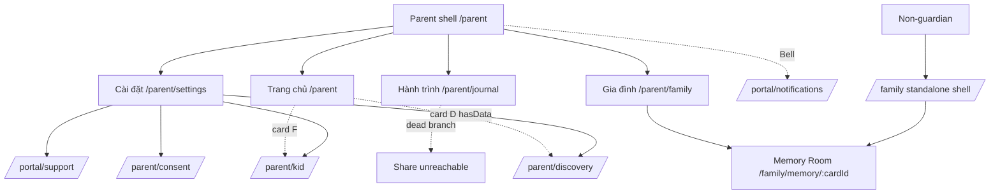
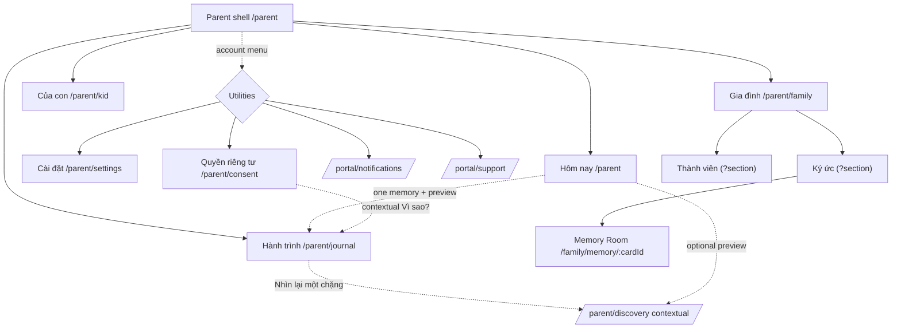
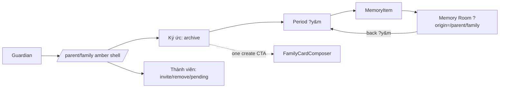
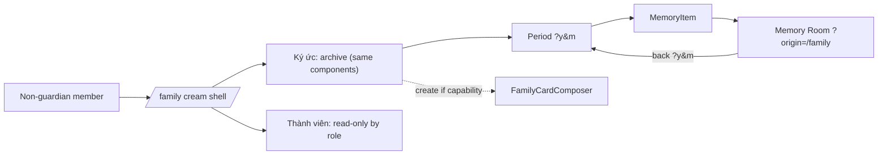
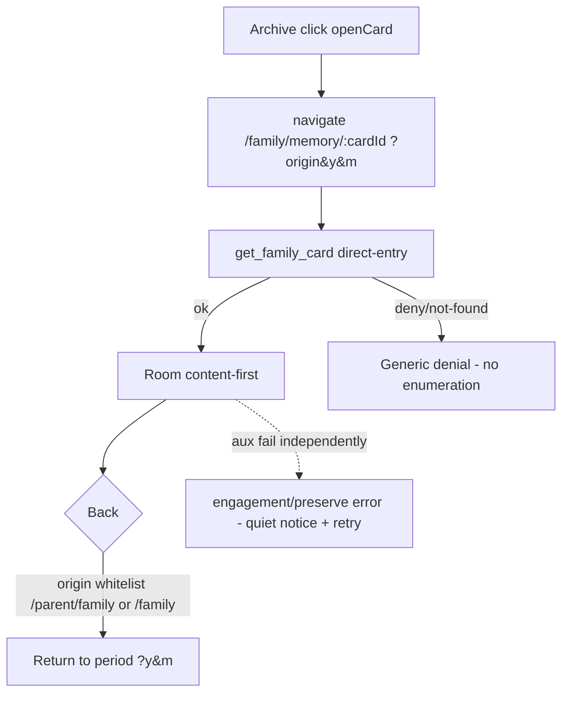

# B1 — TARGET IA & ROUTE FEASIBILITY
**V113B** · Source-aware planning only · ZERO code/route/redirect/schema/deploy.
**Legend:** `CANONICAL` · `OBSERVED_SOURCE` · `OBSERVED_LIVE_DB` · `INFERRED` · `UNKNOWN`.
**Decision provenance:** 🔒 = fixed by Product Owner/ChatGPT (not re-opened here) · 🔧 = Claude feasibility finding · ❓ = evidence gap.

---

## 1. Route feasibility table

| Current route | Future label | Future purpose | Class | Proposed nav entry | Retained route contract | Possible route/state change | Compatibility concerns | Recommendation |
|---|---|---|---|---|---|---|---|---|
| `/parent` | **Hôm nay** (was "Trang chủ") | De-dashboarded landing: identity + one real memory + one action 🔒 | **Primary #1** | bottom-nav slot 1 / desktop rail | route unchanged; `get_child_journal` unchanged `OBSERVED_SOURCE` | none (label only) | none | 🔧 **Feasible, label-only.** Compose from existing contracts (see B2). |
| `/parent/journal` | **Hành trình** | Child art journal (content-first viewer) + host for "Nhìn lại một chặng" 🔒 | **Primary #2** | bottom-nav slot 2 | route unchanged; `get_child_journal`; `ParentJourneyViewer` `OBSERVED_SOURCE` | add contextual Discovery entry (no route change — B4) | live viewer already content-first `OBSERVED_SOURCE` | 🔧 **Feasible.** Refine header/rail to host reflection entry. |
| `/parent/family` | **Gia đình** | Guardian entry to the one Family Experience System 🔒 | **Primary #3** | bottom-nav slot 3 | route + authority unchanged; `get_family_space` etc. 🔒 | internal `Ký ức \| Thành viên` split (see §3) | must **not** merge with `/family` authz 🔒 | 🔧 **Feasible.** Unify experience, keep context. |
| `/parent/kid` | **Của con** (mobile) / **Thế giới của con** (desktop) | Parent→child gateway (preview + "Mở thế giới của {child}"), controls at depth 🔒 | **Primary #4** (promoted) | bottom-nav slot 4 (replaces Cài đặt) | route + Kid authority unchanged; `kid_*` RPCs `OBSERVED_SOURCE` | recompose page hierarchy (gateway-first); controls to secondary depth | already built `OBSERVED_SOURCE` (contradicts "reserved" docs) | 🔧 **Feasible with current contracts.** No new audience/authority. |
| `/parent/settings` | **Cài đặt** | Account hub (password, roster, links) | **Utility** (demoted from nav) | account/utility menu (behind identity) 🔒 | route unchanged; `auth.updateUser` | move out of primary bottom-nav; keep as utility screen | must still reach consent/support/kid links | 🔧 **Feasible.** Demote to utility; keep as hub. |
| `/parent/consent` | **Quyền riêng tư** | Per-child privacy control | **Utility + contextual** 🔒 | utility menu + contextual ("Vì sao?" in Journey, family privacy footnote) | route unchanged; **direct `consents` write kept as-is** 🔒 (F9 parked) | none | consent-write path **not** touched in V113B 🔒 | 🔧 **Feasible.** Add contextual entries; no write-path change. |
| `/parent/discovery` | **Nhìn lại một chặng** (contextual) | Reflection inside Journey + optional Home preview; **not** a 5th primary 🔒 | **Deep / contextual** | from Journey header/rail + optional Home preview (B4) | route + `*_discovery_capsule` contracts unchanged 🔒 | entry-point change only; align child-selector to shared context | no backend change allowed 🔒; own child-selector divergence `OBSERVED_SOURCE` | 🔧 **Feasible without backend change** (entry + selector alignment only — B4). |
| `/family` | *(same experience, member context)* | Non-guardian family-member entry to the Family Experience System 🔒 | **Primary (member context)** | member's own shell (no parent bottom-nav) | route + authority unchanged 🔒 | adopt shared experience components; keep read-only member affordances by role | must **not** merge authz with `/parent/family` 🔒 | 🔧 **Feasible.** Unify components; role gates affordances. |
| `/family/memory/$cardId` | **Memory Room** | Single memory, content-first hierarchy 🔒 | **Deep (shared)** | opened from archive (both contexts) | route + `get_family_card` direct-entry + generic denial unchanged 🔒 (D305) | reorder presentation (content-first); **no authority change** 🔒 | strict `origin` whitelist + `?y&m` return must survive reorder (D306) | 🔧 **Feasible.** Presentation reorder only; keep return + fail-closed. |
| `/portal/notifications` | **Thông báo** | Notifications | **Utility** 🔒 | Bell (contextual) + utility menu; **no new notification functionality** 🔒 | route unchanged | none | cross-shell (`/portal` neutral) `OBSERVED_SOURCE` | 🔧 **Feasible.** Keep as utility; do not build features. |
| `/portal/support` | **Hỗ trợ** | Support | **Utility** 🔒 | utility menu + contextual (empty states) | route unchanged | none | cross-shell | 🔧 **Feasible.** Utility + contextual. |
| `/family-invite#t={token}` | **Lời mời gia đình** | Invite acceptance (public) | **Entry (public)** | external link (one-time, 7d) | route + `accept_family_invitation` unchanged `OBSERVED_LIVE_DB` (edge v1) | none | token in URL fragment (not query) — privacy-preserving | 🔧 **Keep as-is.** |
| `/share/$token` | **Chia sẻ** | Public journal share consumption | **Entry (public)** | external link | route + `resolve_share_link` (edge v8) + `create/revoke_share_link` unchanged | Share currently **not surfaced in live Journey** `OBSERVED_SOURCE` → re-homing is a product decision, not V113B | dead-branch-only wiring `OBSERVED_SOURCE` | 🔧 **Keep route/contracts.** Re-home decision = out of scope (B4/B6). |
| `/kid` (public) | **Cổng của bé** | Child PIN/device entry | **Entry (public)** | device pairing target of `/parent/kid` | route + `kid_gate` (edge v8) unchanged | none | separate child audience (not parent) | 🔧 **Keep as-is.** |

**Gate check — four-primary model feasible:** ✅ `INFERRED`. All four target primaries map to **existing routes** (`/parent`, `/parent/journal`, `/parent/family`, `/parent/kid`); the only structural nav change is **swapping the 4th bottom-nav slot** from `/parent/settings` → `/parent/kid` and relabelling `/parent`→"Hôm nay". No new route, no new audience, no authority change.

## 2. Nav model delta (current → target)

`OBSERVED_SOURCE` (current) → 🔒 (target):

| Slot | Current | Target |
|---|---|---|
| 1 | Trang chủ `/parent` | **Hôm nay** `/parent` |
| 2 | Hành trình `/parent/journal` | **Hành trình** `/parent/journal` |
| 3 | Gia đình `/parent/family` | **Gia đình** `/parent/family` |
| 4 | **Cài đặt** `/parent/settings` | **Của con / Thế giới của con** `/parent/kid` |
| utility | Bell → `/portal/notifications` | Bell + **account menu** → Settings, Consent, Support, Notifications, Sign out |

🔧 The current `parent.tsx` bottom-nav is a `grid-cols-4` of `Link`s (`OBSERVED_SOURCE`); the delta is label + target changes plus a new utility/account entry surface. No route tree change required.

## 3. Family internal IA — `Ký ức | Thành viên` (safest route/state strategy)

🔒 requirement: archive and member administration must be **separated**, not one continuous page. 🔧 feasibility comparison:

| Strategy | Mechanism | Direct-entry / URL | Return safety | Risk | Verdict |
|---|---|---|---|---|---|
| **Query-backed section state** | `?section=kyuc\|thanhvien` on `/parent/family` (mirrors existing `?y&m` pattern `OBSERVED_SOURCE`) | shareable, F5-safe | preserves existing `?y&m` archive params alongside | low — pure additive search param, validated like current ones | ★ **Recommended.** No route tree change; consistent with archive's existing param discipline. |
| **In-page tab state** | React state only | not URL-addressable | fine | loses deep-link/return to a section; least effort | acceptable fallback if no deep-link needed |
| **Nested routes** | `/parent/family/members` etc. | cleanest URLs | new route files + layout restructure | higher — new routes (a change V113B forbids implementing) + touches route tree | not for V113B; note as a later option |

🔧 **Recommendation:** model the split as **query-backed section state** (`?section=`), keeping `?y&m` for the archive — additive, direct-entry-safe, no route tree change, consistent with `OBSERVED_SOURCE` conventions. `/family` (member) shows the same two areas with `Thành viên` in read-only affordance by role. (Implementation deferred.)

## 4. Mermaid — current IA

## 5. Mermaid — approved target IA

## 6. Mermaid — guardian family flow

## 7. Mermaid — non-guardian family-member flow

## 8. Mermaid — Memory Room return flow

🔧 `origin` is a **whitelisted UX hint only** (`OBSERVED_SOURCE` validateSearch → `/family`|`/parent/family`); never authorization (D305). Reordering Room presentation must preserve this return + the generic denial + fail-closed aux.
